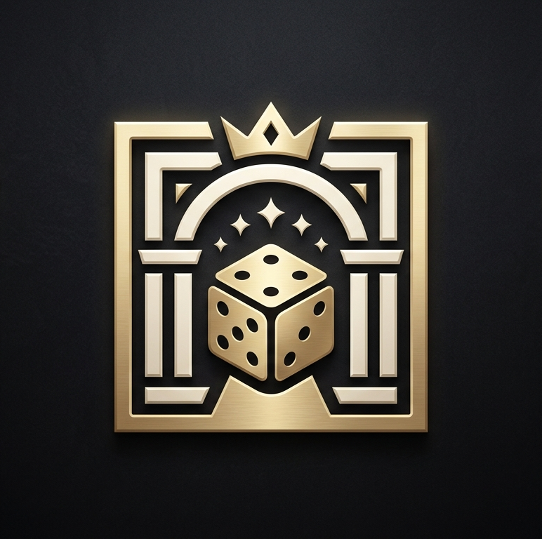

<p align="center">
  
</p>

<h1 align="center">Item Casino</h1>

<p align="center">
  A server-authoritative casino for Minecraft: seven games played with real items or with chips,
  a shared jackpot, and a valuation engine that prices every item from the recipes it takes to make.
</p>

<p align="center">
  <a href="https://github.com/SVecro/ItemCasino/actions/workflows/build.yml"></a>
  
  
  <a href="LICENSE"></a>
</p>

---

## What it adds

Players stake what they carry. Every table knows what an item is worth, so a stack of iron can be bet
against a diamond pickaxe and the odds come out fair (minus the house edge). Or they turn their
currencies into chips at the Cashier, and bet chips on a card.

| Table | Stake | Returns | In short |
|---|---|---|---|
| **Upgrader** | items or chips | 90 % | Pick a target item; a wheel spins at the odds of the trade. Win and you get the target. |
| **Predict the Dice** | chips | 97 % | Choose a chance from 1 to 95 % and a side of the line; the server rolls 0.00–99.99. |
| **Blackjack** | items or chips | ~99.4 % | Up to three players at one table against one dealer. One deck, dealer stands on soft 17, double, late surrender, 3:2 blackjacks. |
| **Coin Flip** | items or chips | 100 % | A duel between two players. Each one's chance is its share of the pot. |
| **Slot Machine** | items or chips | 90 % | Three reels, triples up to ×800, pairs from Iron up. Takes up to 16 items a pull. |
| **Mine Field** | chips | 97 % | A 5×5 board with 1 to 24 mines; cash out whenever you like. |
| **The Vault** | items or chips | 80 % | Draw for a share of the shared jackpot, from 1 to 100 %. |

**Returns** are the long-run share of the stake paid back (Blackjack with basic strategy).

**Chips and the Cashier.** The Cashier turns currencies into chips at their full value: diamonds,
emeralds, gold, iron and copper, as ingots, nuggets or blocks. Chips live on a **Chip Card**, and the
card is bearer: whoever holds it owns the chips. Cashing out gives the same currencies back, for a 2 % fee.
Other items are not bought: they are played at the tables.

**The shared jackpot.** What players lose at the house tables feeds a server-wide pot. The only way
to win it is at the Vault, and every win is announced in chat.

**Also in the box**

- **Blackjack for three.** One shoe, one dealer, each chair playing in turn and settling on its own.
  Alone at the table, *Deal* deals. When others have the table open too, the button says *Ready*:
  the first *Ready* starts a 10-second countdown, and the cards come out as soon as everyone at the
  table is ready, or when it ends, to whoever is ready by then. During a shared hand each player has
  15 seconds per move, so nobody who walked away can hold up the table.
- **Pocket devices**: an Upgrader, a Dice and a Blackjack table you carry in your inventory.
- **Game Core**, the part every table is built on.
- **Stats** for every player (the `$` button in the inventory) and a **mailbox** for winnings that
  cannot be handed over right away.
- Tooltips on every table. Hold **Shift** over any item to see its casino value.
- Every table has an **(i)** in its top-right corner that explains how the game is played.

## Crafting

Every table is one Game Core, five planks and the item that names it:

```
 .  S  .        S = the table's item
 P  C  P        C = Game Core (8 redstone around 1 gold ingot)
 P  P  P        P = any planks
```

| Table | S | Table | S |
|---|---|---|---|
| Upgrader | smithing table | Slot Machine | lever |
| Predict the Dice | quartz block | Mine Field | TNT |
| Blackjack | book | The Vault | nether star |
| Coin Flip | gold ingot | Cashier | emerald |

Nothing in the mod costs a diamond. The Vault alone needs a nether star, because it pays out the
shared jackpot. A pocket device is its table surrounded by 4 paper and 4 gold nuggets. The recipes show up in
the recipe book as you go: the Game Core once you hold redstone, the tables once you hold a core,
each pocket device once you hold its table.

## Fair by construction

- **The server decides everything.** An outcome is drawn once, when the bet is committed, from a
  `SecureRandom`. It is saved, then replayed by the client as an animation. Nothing the client sends
  can change it, and nothing it sees gives away the next one. No result appears before its animation
  has finished.
- **Every stake is held in escrow.** A game cannot pay twice. A game interrupted by a restart is
  finished from the outcome already drawn, never refunded or replayed.
- **Nothing is lost.** Winnings go to the inventory, and to the casino mailbox when they cannot:
  full inventory, a dead or disconnected player. Breaking a table settles it and returns every stake
  to its owner, whatever broke it.
- Shulker boxes and bundles are refused. Packets are rate-limited, and every list sent over the
  network is capped.

## Installing

1. Install **NeoForge 21.11.42** (or a later 21.11 build) for **Minecraft 1.21.11**.
2. Download `itemcasino-<version>.jar` from the
   [Releases](https://github.com/SVecro/ItemCasino/releases) page. Each jar comes with a `.sha256`
   checksum next to it.
3. Put it in the `mods` folder, **on the server and on every client**: the mod adds blocks and
   items, so both sides need it.

The mod is in English.

## Configuring

Server rules live in `config/itemcasino-server.toml`: the house edges, the payout ceilings, the
blackjack rules, the jackpot share, the chip fee, the timers. Two switches are worth knowing about:

- `safety.disabled_games` takes the listed games out of play. Their tables still open, but refuse
  new bets.
- The item tag `itemcasino:not_a_target` keeps items off the Upgrader's wheel. It ships empty.

Commands: `/casino value` and `/casino odds` are open to everyone. `/casino diagnose`, `dump` and
`rebuild` are for operators.

## Building from source

You need a JDK 21. The Gradle wrapper is committed, so nothing else has to be installed.

```sh
./gradlew build               # compiles, runs the unit tests, writes build/libs/itemcasino-<version>.jar
./gradlew runGameTestServer   # starts a headless server and runs the in-world game tests
./gradlew runClient           # a development client with the mod loaded
```

On Windows, use `gradlew.bat`, or the scripts at the root:

| Script | What it runs | Where the result goes |
|---|---|---|
| `run-build.bat` | `build` | `build-status.txt`, `build-errors.txt` |
| `run-gametest.bat` | `build runGameTestServer` | `gametest-status.txt`, `gametest-out.txt` |
| `run-client.bat` | `runClient` | the game window |
| `run-release.bat` | build, game tests, then copies the jar into `releases/` with its SHA-256, but only if both came back clean | `release-status.txt`, `release-out.txt` |

### Tests

- **Unit tests** (JUnit, `src/test/java`): the pure-Java core, which has no Minecraft imports: odds,
  wheel maths, blackjack rules, dice, mines, chips, the session state machine.
- **Game tests** (`runGameTestServer`): 30 tests that run inside a real server. They cover escrow,
  payouts, duels, the Cashier, breaking tables, restarts mid-game and the three-seat blackjack table.
  The log counts one more test than that: Minecraft's own `always_pass`.

[GitHub Actions](.github/workflows/build.yml) runs both on every push and every pull request.

### Where to start in the code

[`HANDOFF.md`](HANDOFF.md) is the developer's guide: the architecture, the rules that keep the
ledger honest, the 1.21.11 API facts that cost a round trip to learn, every bug fixed and what it
taught, and what is still open. [`CHANGELOG.md`](CHANGELOG.md) lists what changed in each version.

```
src/main/java/com/itemcasino/
  core/        pure Java: values, odds, blackjack, dice, mines, chips, the state machine
  session/     one CasinoSession per game, hosted by a block or a pocket item
  block/ menu/ client/ network/ registry/
  valuation/   recipe harvesting and item prices     jackpot/   the shared pot
  player/      stats and mailbox                      gametest/  in-world tests
src/test/java/ JUnit for the core
tools/         offline checks, texture generators
```

## License

[MIT](LICENSE) © 2026 Vecro
